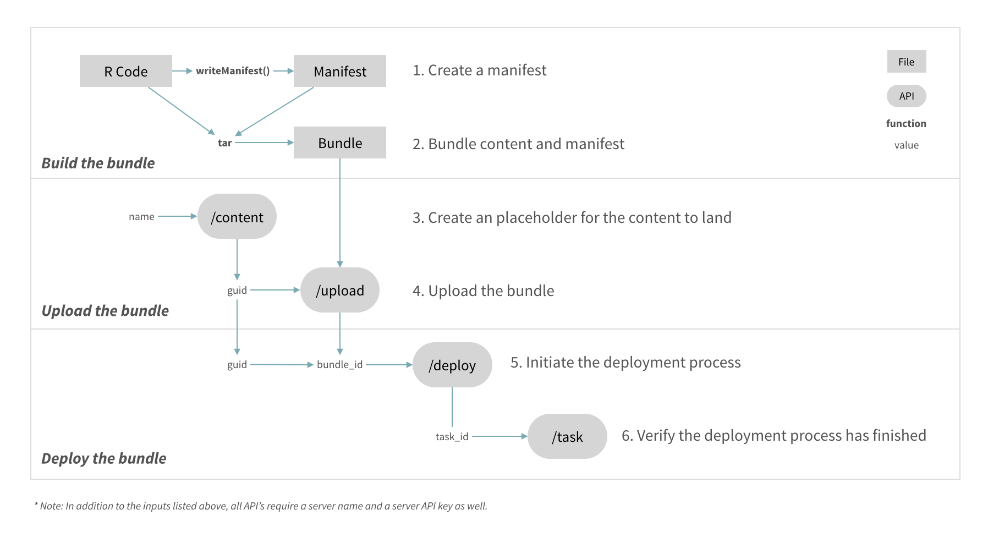

# Deploying content using the RStudio Connect API

Programmatic deployment with the RStudio Connect API. See the [user guide](https://docs.rstudio.com/connect/user/cookbook.html#cookbook-deploying) for more information.

### The deployment process

Deployments involve describing the development environment then recreating the environment on RStudio Connect. 

1. Build the bundle
    * `rsconnect::writeManifest()` - Create manifest
    * `tar` -- Bundle all the files
2. Upload the bundle
    * `POST /content` -- Retrieve a guid
    * `POST /upload` -- Upload the bundle 
3. Deploy the bundle
    * `POST /deploy` -- Deploy the bundle
    * `GET /tasks` -- Verify deployment

### Diagram

