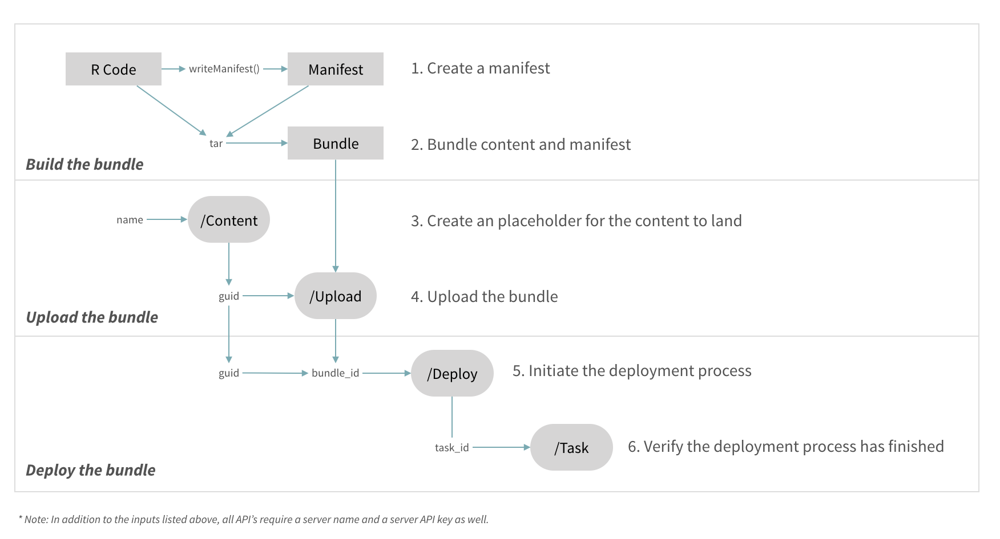

You can use the RStudio Connect APIs to programmatically publish your content. This tutorial gives step-by-step instructions on how to use the RStudio Connect APIs. Code can be found on [here](https://github.com/nwstephens/connect-api). 

For more information on using the RStudio Connect APIs in an actual workflow (e.g. using Docker, Travis, Jenkins, etc.) see the overview at [Programmatic Deployments with Content Management APIs](https://solutions.rstudio.com/deploy/deploy/), an example on [Deploying with APIs](https://github.com/rstudio/connect-api-deploy-shiny), and the [RStudio Connect User Guide](https://docs.rstudio.com/connect/user/cookbook.html#cookbook-deploying).

***

### Deployment Process

***

The deployment process has three steps: Build, upload, and deploy the content bundle. The content bundle contains all your content and a description of your development environment. The overall strategy in deployments is to recreate your development environment in isolation on RStudio Connect.



Your can describe your development environment by creating a manifest in R. The `rsconnect::writeManifest()` function will automatically generate the manifest. The manifest includes a list of the relevant source code, package dependencies, and other metadata including the R version, the locale, the app mode, content category, etc. When you deploy the content bundle, RStudio Connect will parse the manifest and restore the environment. 

The RStudio Connect APIs help you upload and deploy content programmatically. In this tutorial we will use `bash` and `curl` to interact with the APIs.

#### Overview

1. Build the bundle
    * `rsconnect::writeManifest()` - Create manifest
    * `tar` -- Bundle all the files
2. Upload the bundle
    * `POST /content` -- Retrieve a guid
    * `POST /upload` -- Upload the bundle 
3. Deploy the bundle
    * `POST /deploy` -- Deploy the bundle
    * `GET /tasks` -- Verify deployment

#### Bundle

The bundle is a tarball that contains the R code, other data files, and the manifest. You can create the manifest in R using the `rsconnect::writeManifest()` function.

* R code and other data files: These content files (e.g. apps and docs) that you want to publish.
* Manifest: This file describes the environment (e.g. content type, R packages, and R version) that you want to recreate for the published content. 

#### API Inputs

You will need to supply three inputs to the API's. For convenience in later steps you should **set these inputs as environment variables**.

```{r, include = FALSE}
Sys.setenv(NAME = "dynamic13")
# Sys.setenv(CONNECT_API_KEY = "********************************")
# Sys.setenv(CONNECT_SERVER = "https://connect.example.com/")
```

* `CONNECT_API_KEY`: Publishers and admins can request an API key from the RStudio Connect UI. See the [user guide](https://docs.rstudio.com/connect/user/cookbook.html#cookbook-configuring-your-scripts) for more information. 
* `CONNECT_SERVER`: This is the URL for your server. (e.g. "https://connect.example.com/").
* `name`: A unique identifier for the content that is defined by the user.

#### API Outputs

Each API returns an identifier that is used in the next API call.

* `guid`: A unique identifier for the content that is defined by the system.
* `bundle_id`: A unique identifier for the version of content that is used in the content URL.
* `task_id`: An identifier for the completed deployment process.

#### Before you begin

Set your working directory to the app directory. Deployments work better when the all commands and API calls are issued within the app directory.

***

### 1. Build the bundle

***

#### Create a manifest

The manifest defines your development environment. This is done with an R function. The manifest includes things like your R version and package information.

```{r}
rsconnect::writeManifest(appFiles = "app.R")
```

The manifest is written to `manifest.json` in your app directory.

#### Bundle the content and manifest

Bundle your content code and the manifest into a tarball.

```{bash}
tar -czf bundle.tar.gz manifest.json app.R
```

Your code and the manifest are stored in `bundle.tar.gz`.

***

### 2. Upload the bundle

***

#### Create an item placeholder

Using the `POST /content` API, retrieve a globally unique identifier that will act as an item placeholder for your content.

* Inputs: `CONNECT_API_KEY`, `CONNECT_SERVER`, `name`
* Output: `CONTENT_GUID`

```{bash}
curl --silent --show-error -L --max-redirs 0 --fail -X POST \
    -H "Authorization: Key ${CONNECT_API_KEY}" \
    --data '{"name": "'"${NAME}"'"}' \
    "${CONNECT_SERVER}__api__/v1/experimental/content"
```

Save the output for `guid` with the `CONTENT_GUID` environment variable.

```{r include=FALSE}
Sys.setenv(CONTENT_GUID="2df1735b-354f-4d7f-aca3-27a94b32fed8")
```

#### Upload the bundle

Using the `POST /upload` API, upload the bundle to RStudio Connect.

* Inputs: `CONNECT_API_KEY`, `CONNECT_SERVER`, `CONTENT_GUID`
* Output: `bundle_id`

```{bash}
curl --silent --show-error -L --max-redirs 0 --fail -X POST \
    -H "Authorization: Key ${CONNECT_API_KEY}" \
    --data-binary @"bundle.tar.gz" \
    "${CONNECT_SERVER}__api__/v1/experimental/content/${CONTENT_GUID}/upload"
```

Save the output for `bundle_id` with the `BUNDLE_ID` environment variable.

```{r include=FALSE}
Sys.setenv(BUNDLE_ID="25123")
```

***

### 3. Deploy the bundle

***

#### Deploy the bundle

Using the `POST /deploy`, deploy the bundle on RStudio Connect.

* Inputs: `CONNECT_API_KEY`, `CONNECT_SERVER`, `CONTENT_GUID`, `BUNDLE_ID`
* Output: `task_id`

```{bash}
curl --silent --show-error -L --max-redirs 0 --fail -X POST \
    -H "Authorization: Key ${CONNECT_API_KEY}" \
    --data '{"bundle_id":"'"${BUNDLE_ID}"'"}' \
    "${CONNECT_SERVER}__api__/v1/experimental/content/${CONTENT_GUID}/deploy"
```

Save the output for `task_id` with the `TASK` environment variable.

```{r include=FALSE}
Sys.setenv(TASK="P4VUYlBF0wDVCovS")
```

#### Verify the deployment

Verify that the bundle finished. Use `first` to define what part of the output you would like to capture (`first=0` by default).

```{bash}
curl --silent --show-error -L --max-redirs 0 --fail -X GET \
    -H "Authorization: Key ${CONNECT_API_KEY}" \
    "${CONNECT_SERVER}__api__/v1/experimental/tasks/${TASK}?wait=1&first=0"
```

***

### Navigate to your web browser

***

#### Open in RStudio Connect

Congratulations! You can now open your deployed content in RStudio Connect.

```{bash}
# Open in RStudio Connect UI
echo "${CONNECT_SERVER}connect/#/apps/${CONTENT_GUID}"
# Open in solo mode
echo "${CONNECT_SERVER}content/${CONTENT_GUID}"
```
